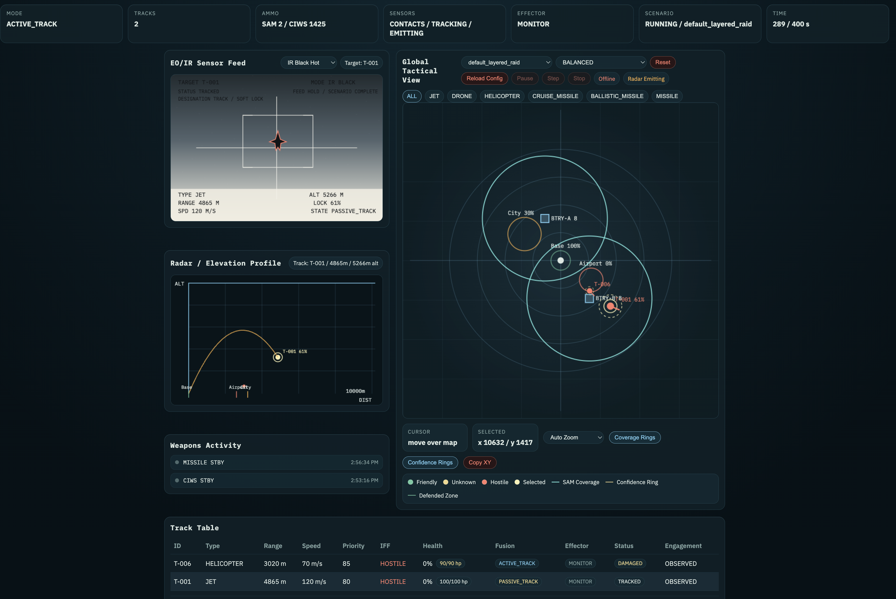

  With all the missiles, drones, and air defense systems constantly in the news lately, I got inspired, in a slightly weird way, to start designing my own air defense simulator.
  What began as a “I wonder how hard it would be to build this” kind of idea turned into a hobby project that is way more entertaining than it probably should be. A Plus is that I learned quite a bit about them and learning new things can be fun. Side note: Never worked in the defense industry either; not on or near any real life systems like this, I just used open source information.

  This repo is my air-defense lab. The idea is to experiment with how a layered defense system might actually behave: spotting threats, building tracks, deciding what
  matters most, assigning weapons, protecting zones, and showing it all in a tactical dashboard. It is not trying to be a finished military-grade simulator, just a
  modular, testable, fun-to-build system that lets me play with sensors, missiles, CIWS, hostile aircraft, and defense logic without needing an actual command center in
  the garage.

  Right now the project runs in software with separate hub, pilot, and shield roles plus a browser UI, but it is also being built so pieces can eventually be split across
  separate hardware like laptops and Raspberry Pis.

  > If you make cool configs for the sim, please share them!

  

# SAM Simulator Prototype

Minimal FastAPI and browser prototype for a tactical SAM dashboard. The current build focuses on a clean WebSocket event contract, a simple 2D tactical renderer, and UI panels that can later host richer simulation state or a CesiumJS-backed map layer.

## Current State

This repository now runs in the intended three-role development layout:

- `hub/`: FastAPI server, browser UI host, and WebSocket broker
- `pilot/`: standalone hostile-aircraft controller client
- `shield/`: standalone air-defense controller client
- `shared/`: message envelopes and shared snapshot contract

The browser dashboard still renders the same tactical picture, but the state now arrives through the hub from separate role processes instead of being generated inside the server itself.

The `shield` role now contains a real first-pass doctrine engine:

- fusion state progression from `TRIPWIRE` through `FIRE`
- per-track threat scoring with transparent reasons
- constrained effector assignment for `CIWS`, `SAM`, or `JAMMER`
- launcher/channel limits and basic shot doctrine
- support for one or several SAM batteries with simple target-sharing
- deterministic engagement lifecycle with `ASSIGNED`, `ENGAGING`, `HIT`, `MISS`, `KILL_ASSESS`, `NEUTRALIZED`, and `REATTACK`
- persistent ammunition tracking for SAM and CIWS inventory
- transition and assignment events for the operator log
- explicit acoustic, IRST, and radar timing gates with handoff behavior

The `pilot` role now maintains hostile truth-state across ticks:

- neutralized targets stop being published as active tracks
- hostile aircraft, helicopters, and drones use simple deterministic ingress maneuvering instead of pure straight-line motion
- damaged hostile jets and helicopters can retreat after a delay once health falls below threshold
- retreating aircraft and helicopters now use a staged retreat turn instead of instant reversal
- missiles remain binary: they survive until intercepted or continue inbound

## Scenario Completion

The simulation now ends automatically when the hub determines one of these conditions:

- `SUCCESS`: all hostile tracks are neutralized or forced to retreat
- `FAILURE`: a hostile track penetrates the protected zone
- `FAILURE`: defensive ammunition is exhausted while hostile tracks remain active
- `TIMEOUT`: scenario elapsed time reaches the configured limit

When a scenario ends, the hub publishes a post-simulation assessment with:

- outcome and executive summary
- hostile counts for active, neutralized, and retreated threats
- ammunition expenditure
- short findings and recommendations

### Cruise Missile

    {
      "track_id": "T-004",
      "type": "CRUISE_MISSILE",
      "iff": "HOSTILE",
      "initial_range_m": 6200.0,
      "altitude_m": 250.0,
      "speed_mps": 240.0,
      "angle_offset_rad": 2.1,
      "approach_rate_mps": 210.0,
      "orbit_rate_rad": 0.03,
      "heading_offset_deg": 40.0
    },

## Shared Wire Contract

All inter-process traffic now uses a shared envelope defined in `shared/messages.py`:

- `schema_version`
- `type`
- `source`
- `timestamp`
- `payload_type`
- `payload`

Current schema version:

- `0.2.0`

Current message types:

- `hub_registered`: sent by the hub when a role connects
- `role_update`: sent by `pilot` or `shield` to publish state contributions
- `snapshot`: sent by the hub to the browser and back out to connected roles

Current payload types:

- `registration`
- `role_update`
- `snapshot`

The browser still consumes the aggregated operator-facing snapshot shape:

- `summary`
- `tracks`
- `events`
- `ciws`
- `passive_tracking`

## What Is A Track?

A `track` is the defense system's current believed picture of one airborne contact.

It is not the raw hostile object itself, and it is not a single sensor hit. A track is the fused contact record the simulator uses for operator display and engagement decisions.

A track can include:

- `id`
- estimated `position`, `range_m`, `speed_mps`, `heading_deg`, and `altitude_m`
- type classification such as `JET`, `HELICOPTER`, `CRUISE_MISSILE`, or `BALLISTIC_MISSILE`
- `iff`
- `fusion_state`
- `engagement_state`
- assigned effector and battery
- target health and status

In this codebase:

- `pilot` owns the truth-side hostile/unit behavior
- `shield` evaluates and manages the track picture used for defense decisions
- the UI renders tracks because that is what the operator sees in the tactical picture and track table

`role_update` payloads are now normalized through shared builders, so each update always carries the same sections even when some are empty:

- `tracks`
- `summary`
- `ciws`
- `passive_tracking`
- `events`

## Target Architecture

The intended deployment model is the "virtual hardware" layout first, then real hardware later:

- `Hub`: central server, UI host, event broker, and world-state distributor
- `Pilot`: hostile platform controller for enemy jets, helicopters, drones, or missiles
- `Shield`: air-defense logic for sensors, fusion, threat scoring, and effectors

Initial development can run these as three separate terminal sessions on one PC:

1. Terminal 1: Hub
2. Terminal 2: Pilot
3. Terminal 3: Shield

Later, the same components should be movable onto separate hardware such as laptops or Raspberry Pis without changing the message contract between them.

## Design Rule For Future Hardware Split

To keep the project portable from one PC to multiple devices:

- simulation logic must not depend on in-process imports across roles
- `Hub`, `Pilot`, and `Shield` should communicate only through shared message schemas
- the browser UI should consume hub snapshots and events, not internal simulation objects
- hostile behavior should remain modular so a later `pilot_group` script can control formations or swarms

Recommended shared message categories:

- `world_snapshot`
- `track_update`
- `sensor_state`
- `engagement_command`
- `engagement_status`
- `event_log`

## Structure

- `hub/`: FastAPI hub and message broker
- `pilot/`: hostile controller client process
- `scenarios/`: reusable hostile behavior and movement templates
- `shield/`: defense controller client process
- `shared/`: shared message schema helpers
- `config/`: editable simulation config such as defended asset zones
- `frontend/`: browser dashboard and static assets
- `backend/`: compatibility entrypoint that re-exports `hub.app`

## Run

1. Create a virtual environment and install dependencies:

```bash
python3 -m venv .venv
source .venv/bin/activate
pip install -r requirements.txt
```

2. Start the hub:

```bash
uvicorn hub.app:app --reload
```

3. In a second terminal, start the pilot:

```bash
python -m pilot.client
```

To select a different hostile scenario for the pilot:

```bash
PILOT_SCENARIO=group_saturation_raid python -m pilot.client
```

4. In a third terminal, start the shield:

```bash
python -m shield.client
```

To test only selected sensors, set `SHIELD_ACTIVE_SENSORS` before starting the shield. Examples:

```bash
SHIELD_ACTIVE_SENSORS=acoustic,irst python -m shield.client
SHIELD_ACTIVE_SENSORS=irst,radar python -m shield.client
SHIELD_ACTIVE_SENSORS=radar python -m shield.client
```

Shield capacity and doctrine can also be configured from the environment:

```bash
SHIELD_MISSILE_CHANNELS=3 \
SHIELD_JAMMER_CHANNELS=2 \
SHIELD_CIWS_CHANNELS=1 \
SHIELD_HIGH_PRIORITY_DOCTRINE=SHOT_LOOK_SHOT \
SHIELD_STANDARD_DOCTRINE=SINGLE_SHOT \
SHIELD_HOLD_FIRE_BELOW_SCORE=45 \
python -m shield.client
```

`SHIELD_MISSILE_CHANNELS` is the number of simultaneous SAM engagements the shield can manage at once. It is a concurrency limit, not an ammo count.

- `ammo`: how many total SAM shots are available
- `missile channels`: how many targets can be assigned or engaged by SAM at the same time

Shield-wide sensor, capacity, and doctrine defaults can now also be configured in:

- `config/shield.json`

Example:

```json
{
  "active_sensors": ["acoustic", "irst", "radar"],
  "capacity": {
    "missile_channels": 3,
    "jammer_channels": 2,
    "ciws_channels": 1
  },
  "doctrine": {
    "high_priority": "SHOT_LOOK_SHOT",
    "standard": "SINGLE_SHOT",
    "hold_fire_below_score": 45
  }
}
```

Environment variables still override `config/shield.json` when both are present.

You can also start and stop the full local stack with the helper scripts:

```bash
./scripts/start_stack.sh
./scripts/stop_stack.sh
```

The scripts start:

- `uvicorn hub.app:app --reload`
- `python -m pilot.client`
- `python -m shield.client`

and write PID files and logs under `.run/`.

## Raspberry Pi Testing

To test the same architecture across laptops and Raspberry Pis, keep the role split the same:

- `Hub`: run on a laptop or desktop that also hosts the browser UI
- `Pilot`: run on a Raspberry Pi or another machine to simulate a hostile platform controller
- `Shield`: run on a Raspberry Pi or another machine to simulate the defense controller

Basic test flow:

1. Put all machines on the same network.
2. Start the hub on one machine and note its LAN IP, for example `<hub-lan-ip>`.
3. On the `Pilot` machine, point the client at the hub WebSocket URL.
4. On the `Shield` machine, point the client at the hub WebSocket URL.
5. Open the browser UI from the hub machine or another machine that can reach the hub.

Example:

```bash
# Hub machine
uvicorn hub.app:app --host 0.0.0.0 --port 8000

# Pilot machine
PILOT_HUB_URL=ws://<hub-lan-ip>:8000/ws/role/pilot python -m pilot.client

# Shield machine
SHIELD_HUB_URL=ws://<hub-lan-ip>:8000/ws/role/shield python -m shield.client
```

When testing on separate hardware, the important rule is to keep all coordination over the shared message contract rather than direct local imports between roles.

5. Open `http://127.0.0.1:8000`.

This is the initial "virtual hardware" workflow:

1. Terminal 1: Hub
2. Terminal 2: Pilot
3. Terminal 3: Shield

## Pilot Scenarios

The pilot now generates tracks from editable JSON scenario definitions instead of hardcoded motion inside the client itself.

Scenario files live in:

- `config/scenarios/default_layered_raid.json`
- `config/scenarios/group_saturation_raid.json`

Current built-in scenarios:

- `default_layered_raid`: a deterministic mixed raid with friendly and hostile tracks
- `group_saturation_raid`: a denser multi-axis hostile raid with jets, drones, and missiles for saturation testing

Scenario duration is defined per scenario with `time_limit_s`. The current built-in limits are:

- `default_layered_raid`: `180` seconds
- `group_saturation_raid`: `240` seconds

You can edit a scenario file directly to change duration or hostile composition. Example:

```json
{
  "name": "group_saturation_raid",
  "time_limit_s": 300,
  "templates": [
    {
      "track_id": "G-101",
      "type": "JET",
      "iff": "HOSTILE",
      "initial_range_m": 9800.0,
      "speed_mps": 210.0,
      "angle_offset_rad": 0.15,
      "approach_rate_mps": 165.0,
      "orbit_rate_rad": 0.05,
      "heading_offset_deg": 20.0
    }
  ]
}
```

Each hostile template supports:

- `track_id`
- `type`
- `iff`
- `initial_range_m`
- `speed_mps`
- `angle_offset_rad`
- `approach_rate_mps`
- `orbit_rate_rad`
- `priority_bias`
- `heading_offset_deg`
- `alive_until_tick`

After editing a scenario JSON file, you can use the browser `Reload Config` control to re-read the scenario files and restart the selected scenario without restarting the processes.

The left log column now has two separate histories:

- `Event Log`: short live operator feed
- `Battle Log`: persistent scenario timeline with milestone-only entries, category/track filters, and an `Export Battle Log` button for JSON after-action review

This is the first step toward later additions such as:

- grouped hostile raids
- swarm behaviors
- scripted ingress and egress patterns
- multiple pilot controllers running at once on separate machines

## Defended Asset Config

Protected zones are now loaded from:

- `config/defended_zones.json`

You can edit this file to add, remove, or move things the simulation should protect.

Each zone supports:

- `id`
- `name`
- `type`
- `position.x`
- `position.y`
- `radius_m`
- `priority`
- `health`

Example:

```json
{
  "zones": [
    {
      "id": "ZONE-CITY",
      "name": "City",
      "type": "CITY",
      "position": { "x": -2600.0, "y": 1900.0 },
      "radius_m": 1200.0,
      "priority": 70,
      "health": 100
    }
  ]
}
```

Current behavior:

- zones render on the tactical map as defended areas
- zone health is shown in the UI
- hostile penetration damages the zone
- a zone reduced to `0` health is treated as a lost defended asset and can end the scenario

## SAM Battery Config

SAM batteries are now loaded from:

- `config/sam_batteries.json`

You can edit this file to increase or decrease the defensive layer without changing code.

Each battery supports:

- `id`
- `name`
- `position.x`
- `position.y`
- `max_range_m`
- `ammo`
- `max_channels`
- `status`

Example:

```json
{
  "batteries": [
    {
      "id": "BTRY-A",
      "name": "Battery A",
      "position": { "x": 0.0, "y": 0.0 },
      "max_range_m": 4500.0,
      "ammo": 8,
      "max_channels": 2,
      "status": "READY"
    },
    {
      "id": "BTRY-B",
      "name": "Battery B",
      "position": { "x": 1400.0, "y": -800.0 },
      "max_range_m": 4200.0,
      "ammo": 6,
      "max_channels": 1,
      "status": "READY"
    }
  ]
}
```

Current behavior:

- total SAM ammo in the summary is the aggregate across all batteries
- `max_channels` is the battery's local missile-channel limit: how many simultaneous SAM engagements that battery can support
- the shield assigns one battery per target unless doctrine requires extra shots
- targets are loosely distributed across available batteries by range and channel availability
- the UI stays compact by showing `SAM` plus the assigned battery label in the existing track views

Very aggressive two-battery example:

- set `capacity.missile_channels` in `config/shield.json` to at least `2`
- set each battery in `config/sam_batteries.json` to `max_channels: 1` or higher
- set doctrine mode in the UI to `AGGRESSIVE`

Example battery setup:

```json
{
  "batteries": [
    {
      "id": "BTRY-A",
      "name": "Battery A",
      "position": { "x": 0.0, "y": 0.0 },
      "max_range_m": 4500.0,
      "ammo": 8,
      "max_channels": 1,
      "status": "READY"
    },
    {
      "id": "BTRY-B",
      "name": "Battery B",
      "position": { "x": 1400.0, "y": -800.0 },
      "max_range_m": 4200.0,
      "ammo": 6,
      "max_channels": 1,
      "status": "READY"
    }
  ]
}
```

With that setup, both batteries can engage at the same time against different targets as long as shield-wide missile channels are not exhausted.

## Current UI Scope

- Summary bar with mode, track count, ammo, sensors, and active effector
- Track table with live sort/filter behavior
- Per-track health and outcome status
- Track confidence scoring with selected-track confidence reasoning
- Event log panel
- Persistent battle log with category/track filters and JSON export
- Report export for post-simulation assessment
- Defense Config panel showing active sensors, channel limits, doctrine, and hold-fire threshold
- CIWS status panel
- Passive tracking panel
- EO/IR sensor feed with EO, IR white-hot, and IR black-hot modes

EO/IR telemetry labels use the track's current simulated values. For example:

- `SPD 120 M/S` means the tracked target is moving at `120 meters per second`
- it refers to target speed, not sensor speed or launcher speed
- Tactical legend for IFF colors, selected track, coverage rings, and defended zones
- Optional tactical-map confidence rings for uncertainty visualization
- Small weapons-activity indicators under the radar profile for missile and CIWS fire cues
- Selected-track drill-down for threat reasons, doctrine, shots planned, and confidence
- Abstract 2D tactical renderer isolated in `frontend/assets/app.js`

## Next Steps

- Formalize and version the shared message schemas as the hardware split becomes more concrete
- Add more scenario modules for grouped and autonomous hostile behavior
- Add tests for backend message formatting and UI state reducers
- Introduce a map adapter interface before adding CesiumJS
